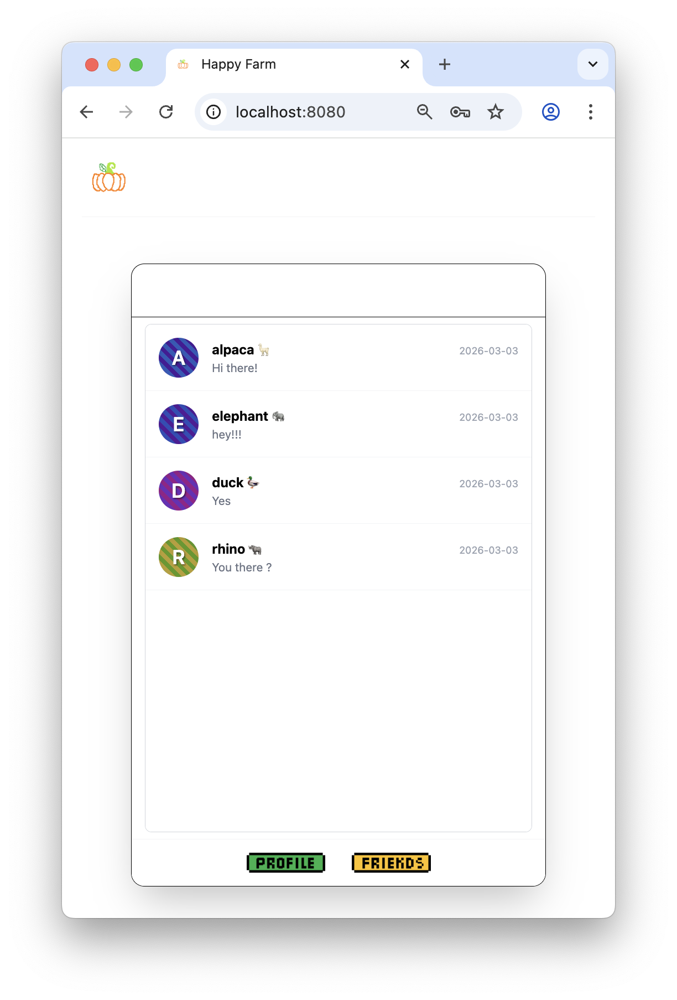
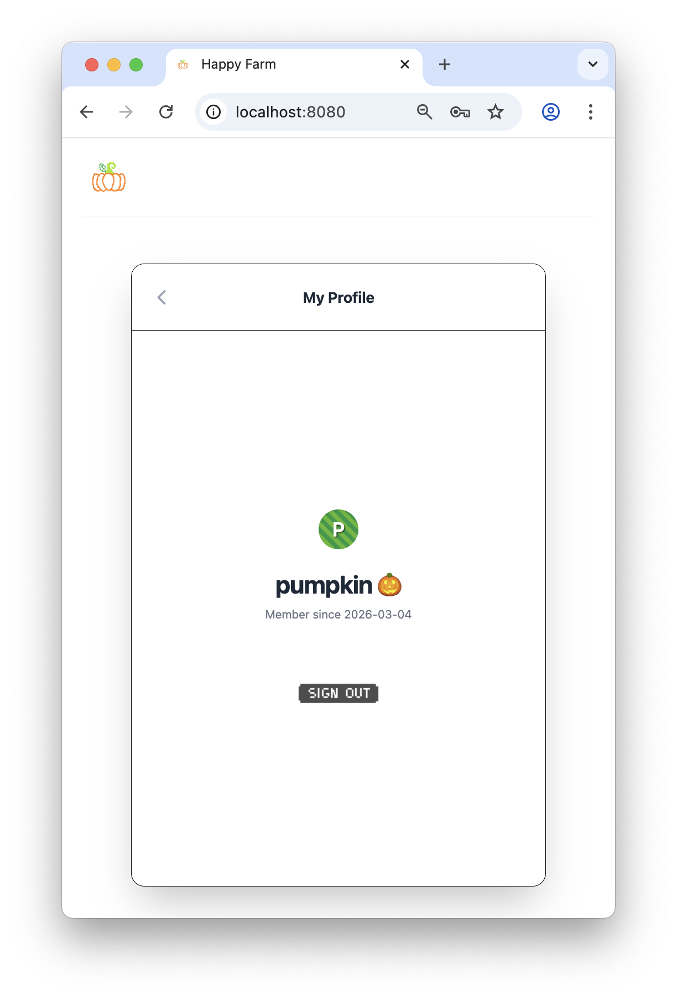
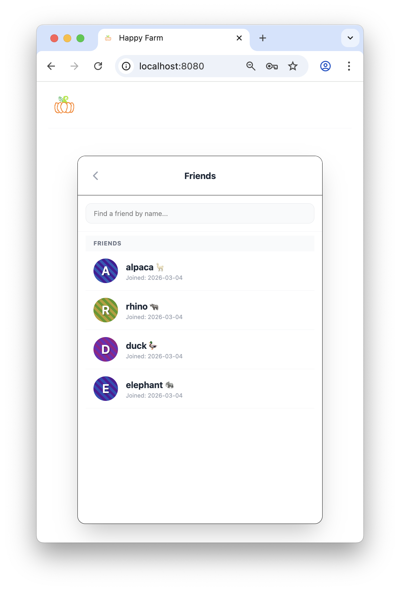
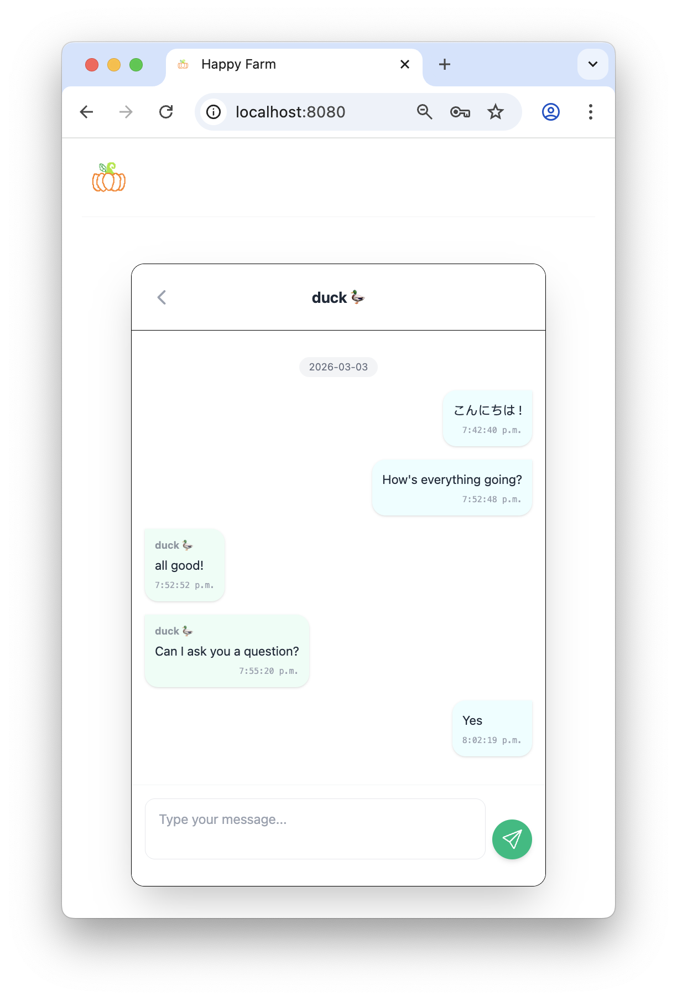
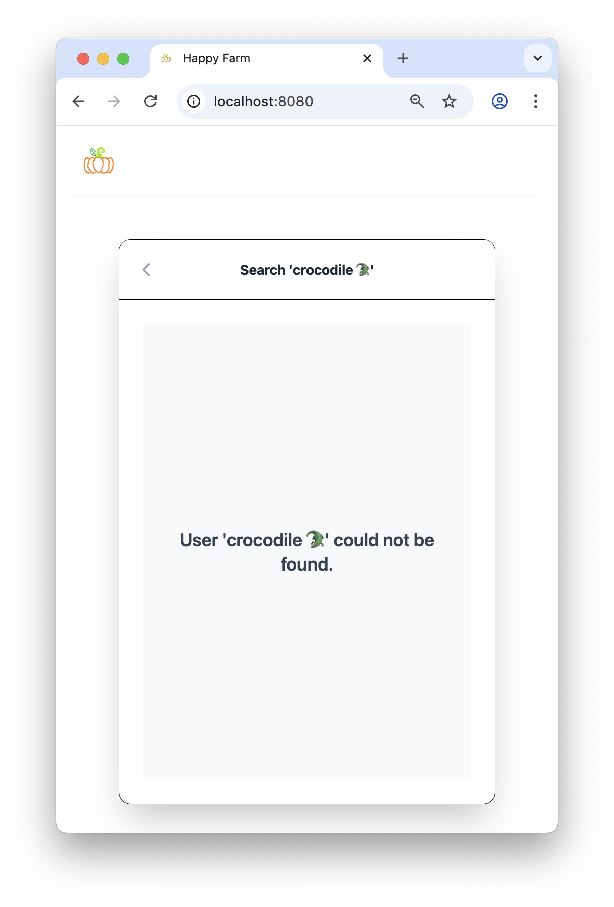

## 🥬 Happy Farm Messenger

<p align="center">
  
  
</p>
<p align="center">
  
  
</p>
<p align="center">
  
</p>

### [ZIO](https://zio.dev/)/[Laminar](https://laminar.dev/)/Actor powered messaging platform  🖊️

Built for fun and total data ownership, Happy Farm is a private social tool for family and friends. Under the hood, it’s a Scala powerhouse: a ZIO-native core with an in-house Actor implementation with the elegance of Laminar (Scala.js)

I have extensive experience working with Akka, but I’ve always wanted to build something non-trivial using ZIO. The effect system was a lot of fun to work with - the waterfall-style composition and explicit error handling make failures predictable and easier to reason about.

A messaging platform is a natural fit for the actor model, where deterministic message ordering within each chat room is important. I initially considered using open-source actor libraries like Pekko (since Akka is no longer fully open source) or Shardcake, but they required more plumbing than I wanted for this project. In the end, I decided to build a lightweight actor system myself, including an internal broadcasting mechanism tailored to the application.

(And Yes! I made those clickable buttons with [Pixilart](https://www.pixilart.com/))

### Features
- Token-Based Registration – Invite-only account creation via manually generated registration tokens (Scala CLI), preventing open public sign-ups
- Friend Management – Search for and add friends
- Real-Time Messaging – Text chat powered by ZIO and an Actor-based backend, with delivery status, retry on failure, and unread indicators etc
- Fault Isolation – Per-room Actors ensure failures in one chat room don’t affect others
- Typing Indicators – Real-time user typing signals

### Work In Progress
- Image sharing
- Video sharing
- Friendship deletion

### Demo

#### Chatting &  Broadcasting real-time (un)messages
<video src="./demo/Chatting.mov" width="50%" controls>
</video>
<video src="./demo/ChatOverview.mov" width="50%" controls>
</video>

#### Add Friend
<video src="./demo/AddFriend.mov" width="50%" controls>
</video>

#### Network glitches handling
<video src="./demo/NetworkIssue.mov" width="50%" controls>
</video>

#### SignIn/Out flow
<video src="./demo/SignInOutFlow.mov" width="50%" controls>
</video>

### Development

1. **Prerequisite**
   - Make sure the following are installed
     - Java 21
     - Scala 3.7.2 (repo is compiled and tested against 3.7.2 - i started the project when 3.7.2 was released but feel free to upgrade to latest version and try out)
     - sbt 
     - Flyway 
     - scala-cli 
     - PostgreSQL (running locally on port 5432)
   - Recommended: Use SDKMAN
     ```shell
        sdk install java 21.0.7-amzn
        sdk install scala 3.7.2
        sdk install sbt
     ```
   - Install additional dep
     ```shell
        brew install flyway
        brew install Virtuslab/scala-cli/scala-cli
     ```
2. **Database Setup**
   - Start PostgreSQL locally
   - Connect to your Postgres instance and run the commands in `db-set.sql`. This will create the required database and user.
   - From the project root directory, run:
     ```shell
        flyway migrate
       ```
     This applies all database migrations.
3. **Generate a Registration Token**
   - The application uses invite-only registration
   - Navigate to the scripts directory and run:
     ```shell
     scala-cli insert-registration-token.sc
     ```
     This will insert a registration token into the database.
     You’ll need this token to register a user.
4. Run the Application(From the project root)
   - Build the application via
     ```shell
      sbt dev
     ```
     Or if you want smaller JS bundle(for prod)
     ```shell
      sbt prod
     ``` 
     It will build JS/CSS bundle ready be to served
   - Now run the application directly:
     ```shell
     sbt "backend / runMain com.happyfarm.backend.HappyFarmMain"
     ```
5. Access the Application
   - Open your browser and go to `localhost:8000`
   - Register user with the token generated earlier